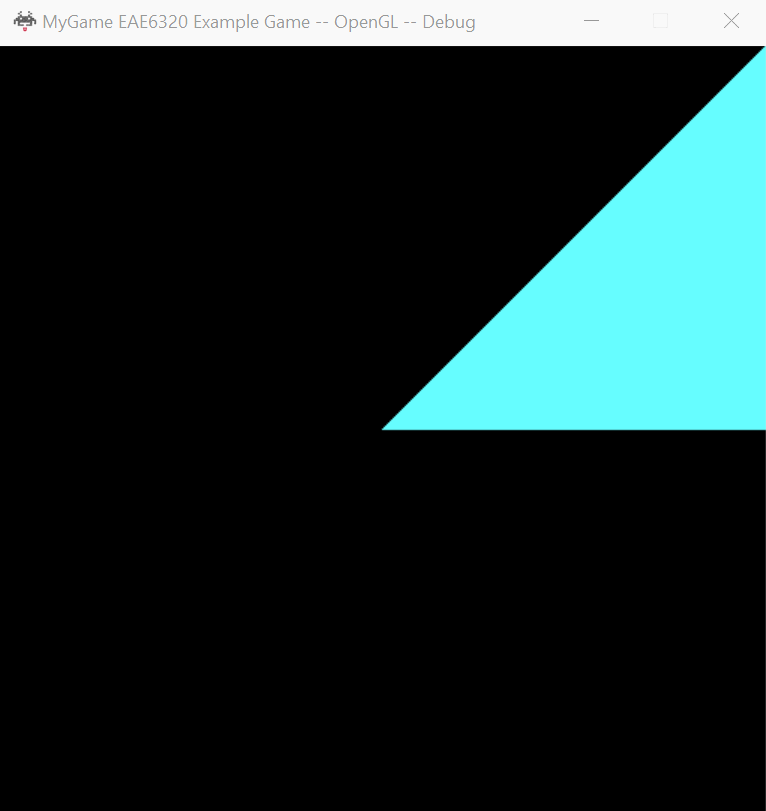
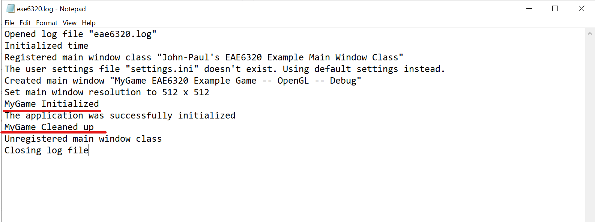

## Assignment 01 Write-up

### Downloads:
[MyGame_x86_debug](https://github.com/XingnanChen/Engineer2/raw/master/Assignment01/MyGame_x86_debug.zip)  
[MyGame_x86_release](https://github.com/XingnanChen/Engineer2/raw/master/Assignment01/MyGame_x86_release.zip)  
[MyGame_x64_debug](https://github.com/XingnanChen/Engineer2/raw/master/Assignment01/MyGame_x64_debug.zip)  
[MyGame_x64_releasse](https://github.com/XingnanChen/Engineer2/raw/master/Assignment01/MyGame_x64_releasse.zip)  

### Assignment Objectives：
1. Create a static library and set up the configurations of it.
2. Create and configure my own game project; Log messages at the beginning and end of the game life cycle.
3. Make an animation that changing the triangle color by creating a new fragment shader.

### ScreenShots 
Animation  
  

Log Message  
  

### Implementation:
1. Static library: Create a project as lib; Change some configurations; Find the references from&to it.
2. Game project: Create MyGame from ExampleGame(Note: change GUID and GameName in project settings); Create MyGameAssets; Set default startup project.
3. Animate color: Change the code in *.Shader (Direct3D uses vec4, OpenGL uses float4). The range of RGB is [0,1].   

### Questions:
#### Tell us which projects needed to add a reference to the new Graphics project? Did you find any projects whose code mentioned the Graphics namespace, but didn't need a reference added? If so, give an example, and explain why the code in question doesn't require a reference. 
Application needs to add the Graphics project reference.
ShaderBuilder has Graphics namespace but doesn’t need the reference because ShaderBuider doesn’t use the functions from Graphics project.

#### Tell us about any thoughts you have about the engine code base that has been provided to you. How is it organized?  
The engine code base is well organized. 

#### Is there anything that you like or don't like about the organization? 
I like it, it separates input and output. 

#### What do you think of the code style?
Good.

#### Is there anything that you like or don't like about it?
Nothing.

#### Is there anything that you were initially confused about? Tell us why you were confused and what you figured out to not be confused. 
At first, I added the Graphics reference to the MyGame project. The solution can be built. I found Application project were using functions from Graphics project without having reference and the MyGame project didn’t use Graphics functions. Then I deleted the Graphics reference to MyGame and added it to Application project.

#### Discuss briefly your expectations of the class based on the first lecture and what you know so far, and tell us what you hope to learn from it. Take some time and think about what you personally might be able to get out of the class that aligns with your interests.
I am interested in how to write an organized engine and learn more about shader and rendering techniques. 

