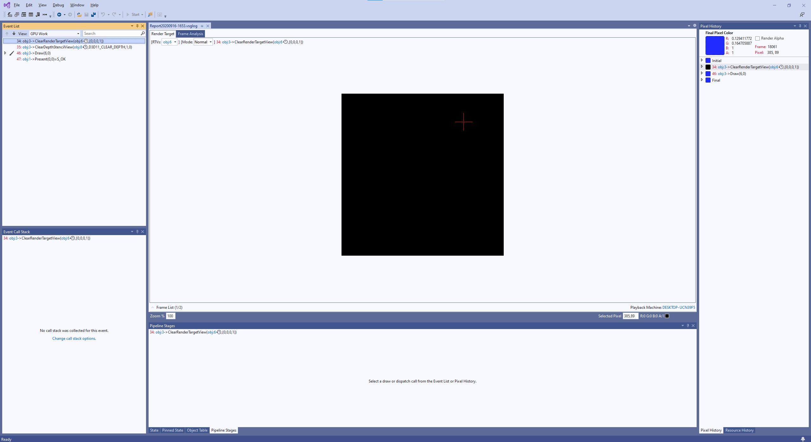
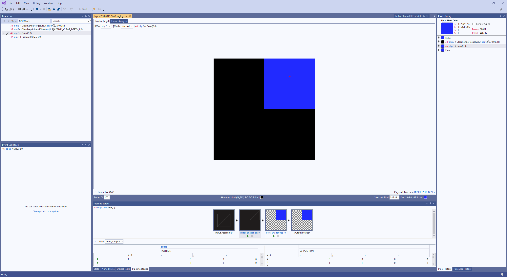
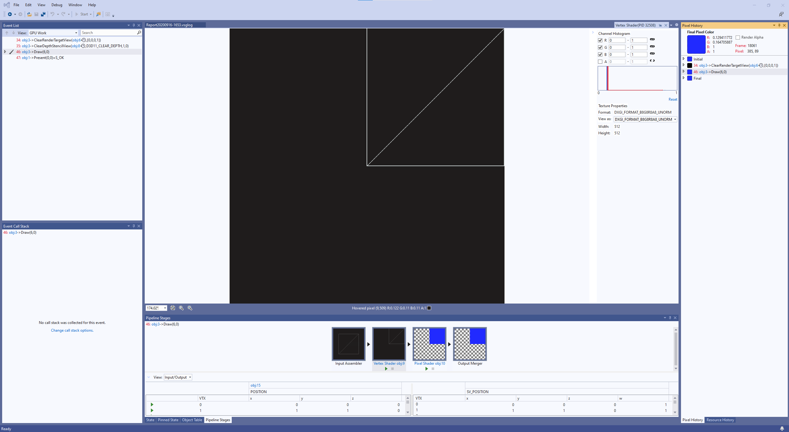
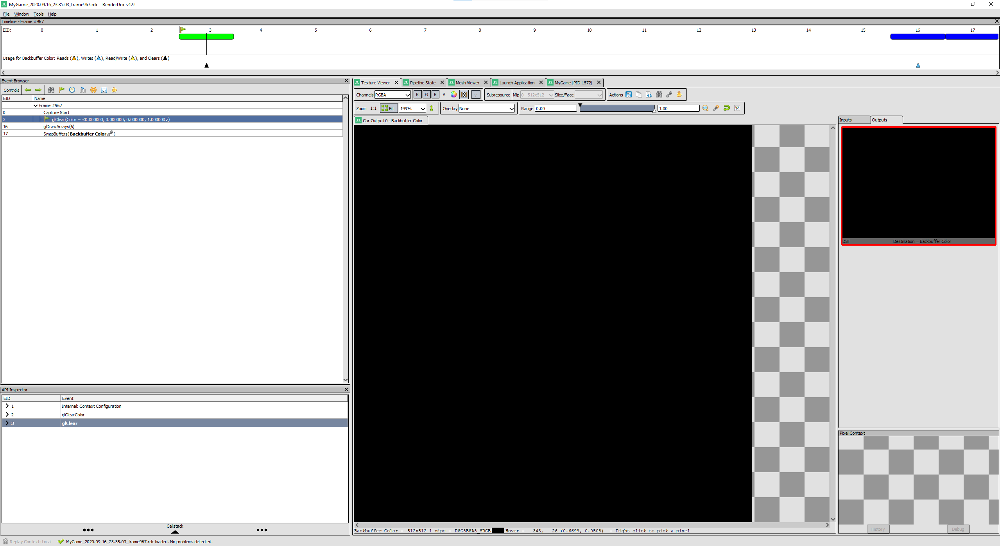
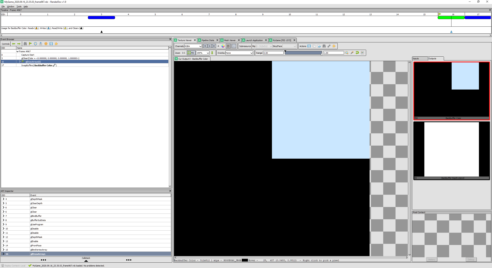

## Assignment 02 Write-up

### Downloads:
[MyGame_x86](https://github.com/XingnanChen/Engineer2/raw/master/Assignment02/MyGame_x86.zip)  
[MyGame_x64](https://github.com/XingnanChen/Engineer2/raw/master/Assignment02/MyGame_x64.zip)  

### Assignment Objectives：
1. Learn about platform-specific and platform-independent implementation.
2. Encapsulate mesh and shader functions into classes.
3. Setup GPU debugger

### ScreenShots 
Animation  
  
 

### Implementation:
1. Create a mesh class and extract the mesh functions from graphics.[platform].cpp.  
    Taking graphics.d3d.cpp as example：  
    a.Create a class called cMesh. There will be cMesh.h and cMesh.cpp. Change cMesh.cpp to cMesh.d3d.cpp.  
    b.Find Geometry Data in graphics.d3d.cpp and put those two variables into cMesh.d3d.h.  
    c.Find all the mesh functions(Draw&Initialize&Cleanup) and put them into cMesh.d3d.cpp.  

2. Create a shader class and extract the shader functions from graphics.[platform].cpp.(Bind&Initialize&Cleanup).  
    Specific steps are the same as creating the mesh class.
3. Replace the code in graphics.[platform].cpp with mesh and shader object invoking functions.
```cpp
    s_mesh.draw();
    s_effect.bind();
```
4. Add another triangle to mesh. Change the triangle count from 1 to 2. Then add another three vertices to the vertex buffer array.
5. GPU debugger  
    a.Direct3D GPU capture  
        
        
      
    b.OpenGL GPU capture  
        
        
      

Basically this assignment is not hard and I didn't spend too much time. 

To make Graphics system interface platform independent, code related to shader pipeline should be put in each own platform's specific cpp file. The part that the code are same in graphics.d3d.cpp and graphics.gl.cpp should be implemented platform independently.
