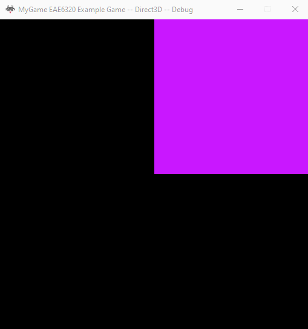
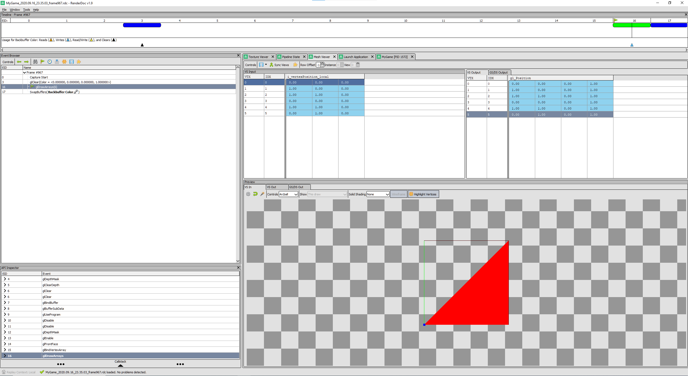

## Assignment 03 Write-up

### Downloads: 
//Todo [MyGame_x86](https://github.com/XingnanChen/Engineer2/raw/master/MyGame_.zip)

### Assignment Objectives：
1. Encapsulate all code from graphics.[platform].cpp into graphics.cpp to implement the platform-independent.  
2. Use the index buffer and vertex buffer to represent the mesh to save memory space.  
3. Change mesh and effect initialize functions with parameters to avoid hard-code.  
4. Add another effect and mesh.  

### ScreenShots //todo
Animation  
  
 

### Implementation:
When moving all codes into Graphics.cpp, we need to find out the platform-specific parts such as clearing the image buffer and depth buffer, swapping buffer. We also need to consider how to initialize the geometry and shading on the different platforms in one function. I created a class called cBufferManager in Direct3D and OpenGL like cMesh. And I declared the interfaces in this header file and implemented those interfaces depending on the platform.  

For example, clearing the image buffer:  
```s_buffer_manager.ClearColor();  ```  

In order to make more flexible codes, we can add parameters to the interfaces. If we want to show the game background with different colors, just add four parameters ClearColor(float red, float green, float blue, float alpha) to make it changeable.  
```s_buffer_manager.ClearColor(1.f, 0.f, 0.f);  ```  
//TODO: Show a screenshot of your game with a clear color (i.e. background) other than black   
 
With the similar thoughts, the effect initializes codes are like:  
 
//TODO: Show code from your Graphics.cpp file that initializes an effect  

//TODO: Explain what data the user is required to specify
And mesh initialize codes are like:
Show code from your Graphics.cpp file that initializes a mesh
Explain what data the user is required to specify
 
 
//TODO:Tell us how much memory a single effect takes up in both platforms (use sizeof() with a debugger rather than guessing). Is there any way to make it smaller?
Show us the data from your struct or class and explain why it couldn't be smaller
If the representation is a different size for different platforms explain why
 
Tell us how much memory a single mesh takes up in both platforms (use sizeof() with a debugger rather than guessing). Is there any way to make it smaller?
Show us the data from your struct or class and explain why it couldn't be smaller
If the representation is a different size for different platforms explain why
 
  
      
