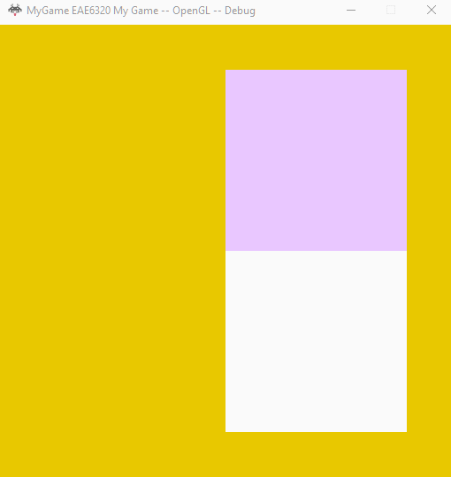

## Assignment 03 Write-up

### Downloads: 
[MyGame_x86](https://github.com/XingnanChen/Engineer2/blob/master/Assignment03/MyGame_x86.zip?raw=true)  
[MyGame_x64](https://github.com/XingnanChen/Engineer2/blob/master/Assignment03/MyGame_x64.zip?raw=true)


### Assignment Objectives：
1.Make an interface in the Graphics that game programmers can submit data(background color, mesh, effect) from MyGame to Graphics.  
2.Make the effects and meshes reference counted.  
3.Change the mesh and effect status when pressed a key.  


### ScreenShots
Game Running  
  
 
### Implementation:
1. Submitting Background Color:  
(1) Create a SubmitBackgroundColor() function in Graphics to save the data from MyGame to s_DataBeingSubmittedByApplicationThread.   
(2) Implement the SubmitDataToBeRendered() function(which is inherited from iApplication) in MyGame to submit the color data to Graphic by calling the submission functions exposed by Graphics.  
```Graphics::SubmitBackgroundColor((sinf(i_elapsedSecondCount_systemTime) + 1) / 2,(1 + cosf(i_elapsedSecondCount_systemTime)) / 2,0.f, 1);  ``` 
(3)When rendering the background color by using ClearUp, I use the cached data from s_dataBeingRenderedByRenderThread.   

2. Reference Counting is used to determine when a pointer should be deleted.  
Using cMesh as an example:   
In cMesh class:   
(1) Add the header and three macros in cMesh class.  
  header:  <Engine/Assets/ReferenceCountedAssets.h>  
  macros:  
  EAE6320_ASSETS_DECLAREREFERENCECOUNTINGFUNCTIONS()  
  EAE6320_ASSETS_DECLAREDELETEDREFERENCECOUNTEDFUNCTIONS( cMesh )  
  EAE6320_ASSETS_DECLAREREFERENCECOUNT()  
(2) Change the constructor, deconstructor, and initialize function to private. 
(3) Create a factory function called Load() to initialize and return cMesh object.    

3. Submitting Meshes and Effects pairs:  
(1) In Graphics:  
Create SubmitMeshAndEffect() function and expose it to MyGame to receive the data. Then cache those meshes and effects into s_DataBeingSubmittedByApplicationThread.  Since we are using two copis of the data to synchronize the application loop thread and the render thread. We can’t render with data directly and have to cache it first. After the previous frame is rendered, the cached data will be swap to the current rendering data and then the current frame will be rendered.  
(2) In MyGame:  
Put all meshes and effects data into SubmitDataToBeRendered() function by creating array of mesh and effect struct. Then give the data by using SubmitMeshAndEffectData() function to Graphics.  
 ```
struct sVertex_mesh  
{  
		float x, y, z;  
} 
 ``` 
```
struct meshData
{
	eae6320::Graphics::VertexFormats::sVertex_mesh* vertexData;
	size_t vertexCount;
	uint16_t* indexData;
	size_t indexCount;
}; 
``` 
```
struct effectData
{
	std::string vertextShaderPath;
	std::string fragmentShaderPath;
};
``` 
 
```
const size_t vertexCount = 4;
Graphics::VertexFormats::sVertex_mesh vertexData[vertexCount];
{
	// OpenGL is right-handed
 
		vertexData[0].x = 0.0f;
		vertexData[0].y = 0.0f;
		vertexData[0].z = 0.0f;
 
		vertexData[1].x = 0.8f;
		vertexData[1].y = 0.0f;
		vertexData[1].z = 0.0f;
 
		vertexData[2].x = 0.8f;
		vertexData[2].y = 0.8f;
		vertexData[2].z = 0.0f;
 
		vertexData[3].x = 0.0f;
		vertexData[3].y = 0.8f;
		vertexData[3].z = 0.0f;
}
	const size_t indexCount = 6;
	uint16_t indexData[indexCount]
	{
		0,1,2,0,2,3
	};
 ```  
 
	
```
meshData meshdata = { vertexData,vertexCount,indexData,indexCount };
effectData effectdata = { "data/Shaders/Vertex/standard.shader", "data/Shaders/Fragment/myShader.shader" };
```  
 
```
//parameters are meshdata effectdata and mesh_effect_pair_counts
	Graphics::SubmitMeshAndEffect(meshdata, effectdata, 1);
```  
 
 	
Tell us the sizeof(YOUR MESH) in both platforms after you have made it reference counted (use the compiler or debugger to tell you the exact sizeof())
Show us the data members
Is there any way that you could make it smaller? (If so, you should!)
Is there any way that you could make it bigger? (If so, don't!)
(I am specifically asking about your mesh representation and what data it's required to store and how that data is laid out. Yes, you could add random member variables that don't do anything to make it any arbitrarily large size, but that's not what I'm asking. Instead, tell us: Is there any way to change the member variables that you currently have to make it smaller? Is there any way that you could reorder the member variables that you have to make it smaller or bigger? If so, tell us specifically what you could do.)
Tell us the sizeof(YOUR EFFECT) in both platforms after you have made it reference counted (use the compiler or debugger to tell you the exact sizeof())
Show us the data members
Is there any way that you could make it smaller? (If so, you should!)
Is there any way that you could make it bigger? (If so, don't!)
(I am specifically asking about your effect representation. See the explanation above about meshes and answer the same specific questions for your effects.)
Tell us the total memory that you have budgeted to your Graphics project for data to render frames
You will have to do some math for this. There are:
2 sDataRequiredToRenderAFrame structs
Each of those structs will have a size (use sizeof() to make sure you get an accurate count)
Some of the data stored in those structs may be pointers. You will have to decide whether the memory that these pointers point at should be included or not.
 
 
4. Respinding to input

