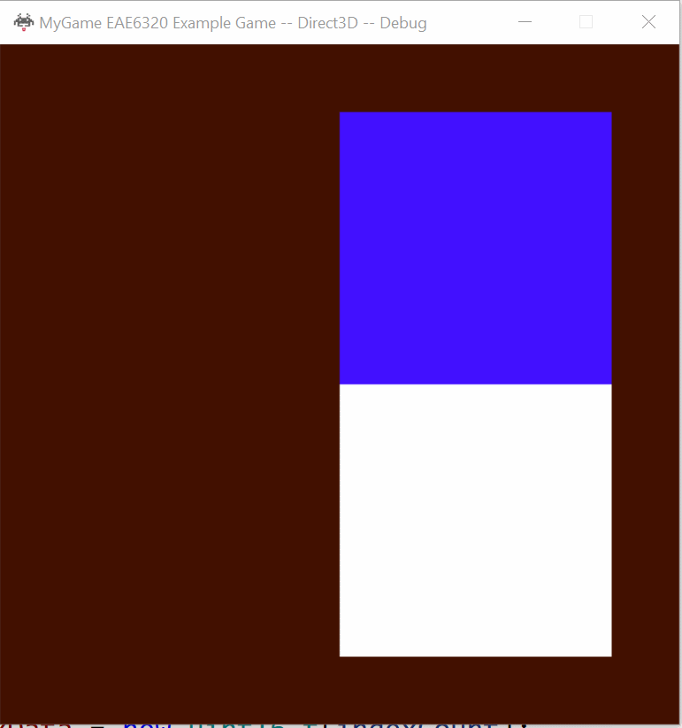

## Assignment 05 Write-up

### Downloads: 
//todo
[MyGame_x86](https://github.com/XingnanChen/Engineer2/blob/master/Assignment04/MyGame_OpenGL.zip?raw=true)  
[MyGame_x64](https://github.com/XingnanChen/Engineer2/blob/master/Assignment04/MyGame_D3D.zip?raw=true)


### Assignment Objectives：
- Represent a camera/object  
- Move the camera/object by changing the velocity when holding down the keys  
- Platform-Independent shaders  

### ScreenShots
Game Running  
  

We can see from the gif the user can move the camera around by w,a,s,d and can control the above object with arrow keys.
When user press F4. The mesh above will switch it's mesh from a square to a triangle.

### Implementation:  
Use object class as an example:  
1. Represent a camera/object  
- Create the object class:  
//todo put the object class code here  
```cpp
class GameObject
    {

    public:
        GameObject() = default;
        GameObject(
            Graphics::meshData i_mesh,
            Graphics::effectData i_effect,
            Physics::sRigidBodyState i_rigidbody);
        ~GameObject() = default;

        Graphics::meshData m_mesh;
        Graphics::effectData m_effect;
        size_t count;
        Physics::sRigidBodyState m_rigidbody;
        Math::sVector m_previous_position;

        void MoveObject(const float i_elapsedSecondCount_sinceLastSimulationUpdate);

    private:
        void UpdateVertex();
};
```  
There are three member variables: m_mesh to save the object mesh data such as vertex data, m_effect to save the effect data such as shader data, and m_rigid_body to save the object physics data such as position and velocity.   
When we create a class. it’s easier for programmers to create new objects by using a class instead of changing arrays.  
We have to render the game frame by frame, so extrapolation on position of the object is necessary to draw the object precisely on each frame.  

- Change the logic in cMyGame and Graphics by using the object class  

```cpp
Graphics::SubmitMeshAndEffect(&m_gameObjects[0], 2);  
```
This is the interface for user to submit the gameobject to graphics engine, the first argument is a gameobject pointer, the second is number of objects to be rendered.
Though the interface is called submit mesh and efect, the user just need to submit the object that the mesh and effect data belongs to.
I changed the interface from submitting meshdata and effectdata arrays to submitting the objects array, because I think it’s simple to iterate the data in Graphics and it’s clear for the gameplay programmer to understand the interface.  
In OpenGL 540 Bytes are needed for each draw call while 632 bytes is needed for D3D platform. 
2. Move the camera/object by changing the velocity when holding down the keys  
There are some exist functions in the sRigidBodyState class to update the velocity or the position of objects. In order to change the    
3. Platform-Independent shaders  
Make DeclareConstantBuffer() and main() function to platform-independent in shaders.inc by using macro. Actually, I have already finished this requirement in assignment 01, I just need to implement a macor to declare main function and everthing became platform independent besides output color declaration.
 

