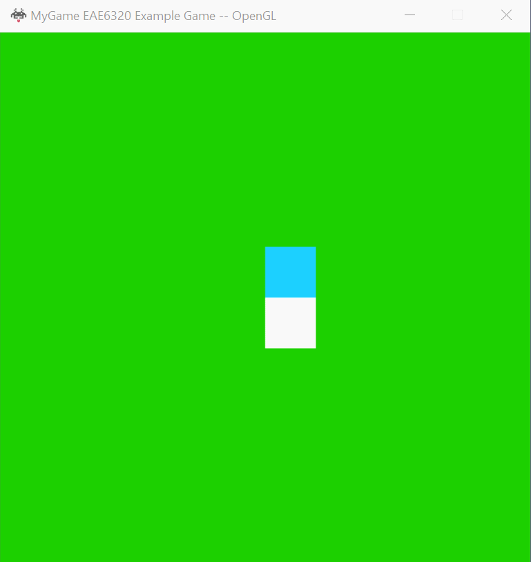

## Assignment 05 Write-up

### Downloads: 

[MyGame_x86](https://github.com/XingnanChen/Engineer2/blob/master/Assignment05/MyGame_x86.zip?raw=true)  
[MyGame_x64](https://github.com/XingnanChen/Engineer2/blob/master/Assignment05/MyGame_x64.zip?raw=true)


### Assignment Objectives：
- Represent a camera/object  
- Move the camera/object by changing the velocity when holding down the keys  
- Platform-Independent shaders  

### ScreenShots
Game Running  
  

We can see from the gif the user can move the camera around by w,a,s,d and can control the above object with arrow keys.
When user press F4. The mesh above will switch it's mesh from a square to a triangle.

### Implementation:  
Use object class as an example:  
1. Represent a object  
- Create the object class:  
```cpp
class GameObject
    {

    public:
        GameObject() = default;
        GameObject(
            Graphics::meshData i_mesh,
            Graphics::effectData i_effect,
            Physics::sRigidBodyState i_rigidbody);
        ~GameObject() = default;

        Graphics::meshData m_mesh;
        Graphics::effectData m_effect;
        size_t count;
        Physics::sRigidBodyState m_rigidbody;
        Math::sVector m_previous_position;

        void MoveObject(const float i_elapsedSecondCount_sinceLastSimulationUpdate);

    private:
        void UpdateVertex();
};
```  
There are three member variables: m_mesh to save the object mesh data such as vertex data, m_effect to save the effect data such as shader data, and m_rigid_body to save the object physics data such as position and velocity.   
When we create a class. it’s easier for programmers to create new objects by using a class instead of changing arrays.  
We have to render the game frame by frame, so extrapolation on position of the object is necessary to draw the object precisely on each frame.  

- Change the logic in cMyGame and Graphics by using the object class  

```cpp
Graphics::SubmitMeshAndEffect(&m_gameObjects[0], 2);  
```
This is the interface for user to submit the gameobject to graphics engine, the first argument is a gameobject pointer, the second is number of objects to be rendered.
Though the interface is called submit mesh and efect, the user just need to submit the object that the mesh and effect data belongs to.
I changed the interface from submitting meshdata and effectdata arrays to submitting the objects array, because I think it’s simple to iterate the data in Graphics and it’s clear for the gameplay programmer to understand the interface.  
In OpenGL 540 Bytes are needed for each draw call while 632 bytes is needed for D3D platform. 

camera class is defined as:  

```cpp
class cCamera
{

public:
    cCamera() = default;
    cCamera(
        Math::cQuaternion i_cameraOrientation,
        Math::sVector i_cameraPosition,
        float i_verticalFieldOfView_inRadians,
        float i_aspectRatio,
        float i_z_nearPlane,
        float i_z_farPlane
        )
    : 
    m_cameraOrientation(i_cameraOrientation),
    m_verticalFieldOfView_inRadians(i_verticalFieldOfView_inRadians),
    m_aspectRatio(i_aspectRatio),
    m_z_nearPlane(i_z_nearPlane),
    m_z_farPlane(i_z_farPlane)
    {
        m_rigidbody.position = i_cameraPosition;
    }

    Physics::sRigidBodyState m_rigidbody;
    Math::cQuaternion m_cameraOrientation;
    float m_verticalFieldOfView_inRadians;
    float m_aspectRatio;
    float m_z_nearPlane;
    float m_z_farPlane;
};
```

```cpp
    Physics::sRigidBodyState m_rigidbody;
    Math::cQuaternion m_cameraOrientation;
```
m_cameraOrientation and position from m_rigidbody are used to define the WorldToCamera transformation.


```cpp
    float m_verticalFieldOfView_inRadians;
    float m_aspectRatio;
    float m_z_nearPlane;
    float m_z_farPlane;
```
The rest are used to create the CameraToPorjected transformation.

Once the camera is initialized, the camera object is submitted to the data to be rendered like other data. Follow the same logic, these data will be used by shader at runtime.


2. Move the camera/object by changing the velocity when holding down the keys  
There are some exist functions in the sRigidBodyState class to update the velocity or the position of objects. A function called PreedictFuturePosition() is used to calculated  the net position of the object. In function submitdatatoberendered or updatesimulationbasedontime we can update the position of the object. And similar to the previous assignment, the velocity of the object is changed when a key is pressed. There isn't anything to talk about it, if you're curious on how to do it, please check the previous assignment.

3. Platform-Independent shaders  
Make DeclareConstantBuffer() and main() function to platform-independent in shaders.inc by using macro. Actually, I have already finished this requirement in assignment 01, I just need to implement a macro to declare main function and everthing became platform independent besides output color declaration. One thing to notice is that the macro for D3D platform should refer to the HLSL preprocessor. The macro for OpenGL should follow the rules of the GLSL preprocessor(same with C). I didn't check the details but they may be different. 
 

